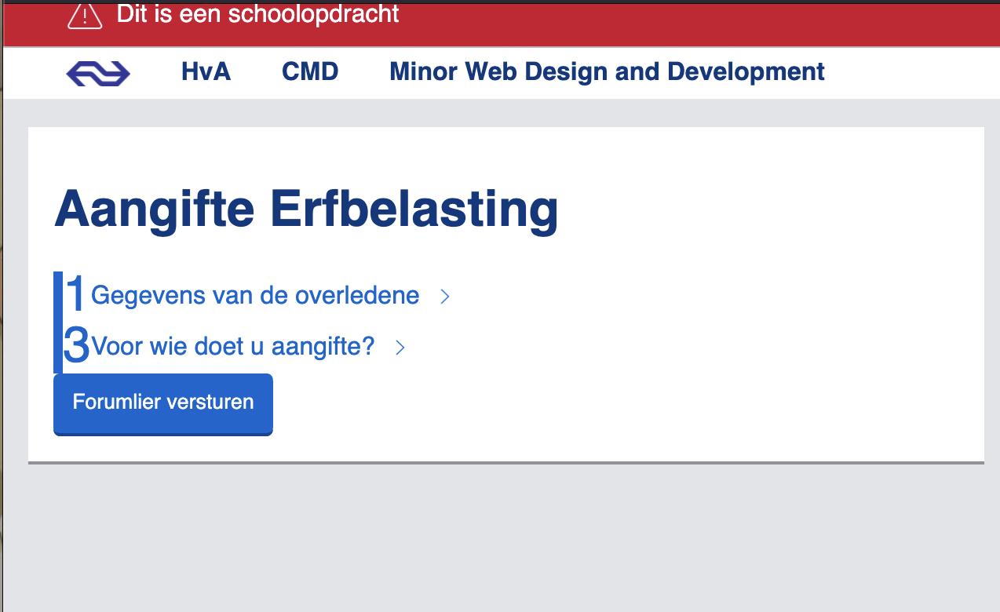

# Schoolopdracht voor CMD aan de HvA

Een belastingformulier maken in de huisstijl van de Nederlandse Spoorwegen

## Week 1
### Dag 1

Wat heb ik vandaag gedaan?
- Ik heb vraag 1 van het formulier helemaal uitgetipt in HTML en alvast wat input types en attributen gegeven
- Daarnaast heb ik de progressive disclosure voor vraag 1 helemaal uitgewerkt in CSS. Maar ik kwam erachter dat dit niet goed werkt, als je later een vraag in het begin bewerkt, omdat de display: none; niet de checked attributen weghaald. Helaas. Dus eigenlijk was mijn werk van vandaag voor niks.
- De weekly geek gelezen over de nieuwe tahoe icons

Hoe lang duurde het?
- 4 uur

Wat heb ik geleerd?
- Hoe ik progressive disclosure met CSS kan implementeren maar ook dat ik dat beter niet moet doen omdat het niet helemaal goed werkt :)

Wat ga ik morgen doen?
- kijken naar hoe ik de progressive disclosure beter met javascript kan maken. 
- kijken naar error prevention

### Dag 2

Wat heb ik vandaag gedaan?
- Ik probeerde progressive disclosure met javascript op te lossen omdat CSS heel moeilijk leek. Maar dit bleek ook ontzettend moeilijk te zijn. Ik heb heb allemaal opgegegeven en in de laatste 20 minuten alle JavaScript verwijdert en toch meer met CSS begonnen. Helaas heb ik een heel specifieke visie in mijn hoofd hoe alles moet werken en dat blijkt heel lastig gedaan.

Hoe land duurde het?
- 4 uur

Wat heb ik geleerd?
- Dat progressive disclosure gewoon moeilijk is. Zowel met CSS als met JavaScript. En dat ik het niet snap. En dat ik het niet meer leuk vind als het niet werkt. 

Wat ga ik morgen doen?
- Nieuw vak, CSS! Alleen ben ik dus nog helemaal niet ver met dit vak, en ik zou graag verder willen werken. Maar hopelijk is het morgen weer leuker.

### Weekly Check-Out

Ik heb deze week heel veel geprobeert en niet heel veel bereikt. Ik wilde graag elke vraag een voor een laten zien en alleen de nodige vervolgvragen open klappen. Daarmee heb ik de hele structuur van het formulier omgegooid, maar helaas kreeg ik dat niet werkend. Ik kon ook moeilijk om hulp vragen omdat ik dus zo'n andere layout gebruikte dan andere mensen, dus hun oplossingen voor de progressive disclosure werkten niet bij mij. Maar na heel veel proberen en falen en kijken wat andere mensen hebben gedaan heb ik toch maar besloten om het op dezelfde manier op te lossen als mijn klasgenoten. Dus 3 regels CSS en tóch wel de originele layout van het belastingformulier. 

## Week 2
### Dag 3

Wat heb ik vandaag gedaan?
- Workshop JS validation
- Ik heb de tweede pattern van vraag 3a in mijn HTML gezet
- Ik dacht, dat ik het beste een radio selectie kan maken, en dat dan de label van de radio button ook de label van de aantal-input wordt. Alleen bleek dat niet heel goed te werken. Ik kon in JS ervoor zorgen dat de label reassigned wordt bij selectie, maar dan gaan er dingen mis bij het formulier versturen, want wat gebeurd er dan met de radio button die geen label meer heeft?
- Dus ik heb vervolgens iets anders geprobeerd. Elke radio button had wat extra uitleg over de aantal-input. Dus ik heb ervoor gezorg dat die extra uitleg een aparte label voor de aantal-input wordt. De label veranderd nu afhankelijk van welke radio button is geselecteerd, en de extra uitleg wordt door JS uit de radio button label gehaald. Als JS breekt, is de extra uitleg dus nog wel te lezen.
- Ik heb de weekly geek gelezen

Hoe lang duurde het?
- 4 uur zelf werken

Wat heb ik geleerd?
- dat je best wel veel dingen op true/false kunt checked in JS, zelfs een document.querySelector

Wat ga ik morgen doen?
- Alvast een beetje CSS, de huisstijl kleuren in mijn CSS zetten
- Beginnen aan validatie
- Vraag 3b toevoegen

### Dag 4 
Wat heb ik vandaag gedaan?
- Ik heb vandaag gekeken naar zowel CSS als ook Javascript validatie. Ik heb automatische capitalization toegevoegd voor de velden waarvoor dat nodig is. Verder heb ik de 11 proef toegepast op de BSN nummer velden, en ik heb ervoor gezorgd dat Javascript het huidige datum ophaalt en op basis daarvan de datum velden een max value geeft. En ik heb ervoor gezorgd dat alle velden die zichtbaar zijn required zijn en alles wat niet zichtbaar is niet required is.

Hoe lang duurde het?
- de hele dag

Wat heb ik geleerd?
- JS validatie toepassen, dat had ik nog nooit eerder gedaan

Wat ga ik morgen doen?
- Beginnen aan styling!!

### Weekly check-out
Tijdens de check-out hebben we besproken, dat voor mij de volgende stap gaat zijn om styling te doen. Ik wilde eerste een goede basis neerzetten, en mijn feedback was dat dat ook het geval was. Maar toch lijkt voor mezelf het alsof ik nog niet heel ver ben, omdat ik dus nog helemaal geen styling heb. Maar het was goed om te horen dat ik toch al best ver ben.
Wat ik nog zou kunnen doen, is wel nog een extra pattern toevoegen omdat mijn extra pattern toch nog wat weinig is. Verder kan ik nog overwegen om mijn progressive disclosure andersom te stylen, dus vragen pas laten zien als je op ja klikt in plaats van verbergen.

## Week 3
### Dag 5 
Wat heb ik vandaag gedaan?
- ik was ziek dus ik heb thuis een klein beetje verder gewerkt. 
- Ik heb mijn progressive disclosure omgedraaid zoals besproken bij de voortgang. 
- Ik eindelijk aan de styling gewerkt en er tegen aan gelopen dat mijn error messages wel door de browser getoond worden maar dat dat mijn velden niet in CSS invalid maakt... ik weet niet zo goed wat ik hieraan moet doen

- Verder heb ik voor nog meer progressive disclosure ervoor gekozen om van de verschillende vragen details te maken, zodat er niet altijd het hele formulier open staat

- mooie 

Hoe lang duurde het?
- de hele dag

Wat heb ik geleerd?
- dat validity in CSS en JS niet zo goed samenwerkt... of ik iets verkeerd doe, dat kan ook

### Dag 6
Wat heb ik vandaag gedaan?
- Ik heb vandaag alleen maar aan JavaScript validatie gewerkt

Hoe lang duurde het?
- de hele dag

Wat heb ik geleerd? 
- heel veel javascript, ik denk dat ik er morgen nog meer ga leren want dan ga ik alles wat overzichtelijker maken, nu staat alles los maar ik denk dat ik dat ook nog algemener kan doen.

Wat ga ik morgen doen?
- Mitchel zei: "wat als de javascript uit staat?". Dat is een hele goede vraag. De validatie doet het dan volgens mij niet meer zo goed. Hm. Ik moet even kijken wat ik daarmee doe. 
- Validatie mooier maken, het werkt nu wel goed maar soms op momenten waarop je dat niet wilt. Zoals als je de pagina opent. 
- Betere styling voor de delen waar ik nu nog geen aandacht aan heb besteed

## Week 4
### Dag 7 
Wat heb ik vandaag gedaan?
- Final sprints!! die niet helemaal zo final zijn omdat ik nog veel moet doen.
- Ik heb de tweede pattern toegepast. Ik had tot nu toe alleen maar vraag 3a in mijn code maar ik heb nu ook nog 3b en 3c toegevoegd. Dus ik heb eraan gewerkt dat ik met javascript nieuwe verkrijgers kan toevoegen, maar dat er ook een bepaald aantal verkrijgers beschikbaar zijn als de Javascript uitstaat. Ik voeg hier dynamisch met JS nieuwe HTML toe, maar ik heb ook verkrijgers die op display none staan. Ik heb ervoor gezorgd dat de button om nieuwe verkrijgers toe te voegen verdwijnt als je Javascript uitzet en dat alle 4 standaard verkrijgers te zien zijn. 
- Verder heb ik alles aangepast wat nog niet goed werkte, ik heb opnieuw naar alle validatie gekeken en wat extra dingen toegevoegd
- Ik heb verder een error samenvatting voor bovenin de pagina toegevoegd als je op submit klikt
- 

## Bronnen

- Parent element met de class "step" ophalen: https://chatgpt.com/c/69944df7-89ec-832b-b1fe-6797e323fec2
- Closest parent element https://developer.mozilla.org/en-US/docs/Web/API/Element/closest
- Elf proef https://financieel.infonu.nl/diversen/180745-elfproef-voor-rekeningnummer-of-burgerservicenummer-bsn.html
- Current time https://www.geeksforgeeks.org/javascript/how-to-get-current-time-in-javascript/
- Date https://developer.mozilla.org/en-US/docs/Web/JavaScript/Reference/Global_Objects/Date
- Custom details arrow https://www.tutorialpedia.org/blog/can-i-replace-the-expand-icon-of-the-details-element/